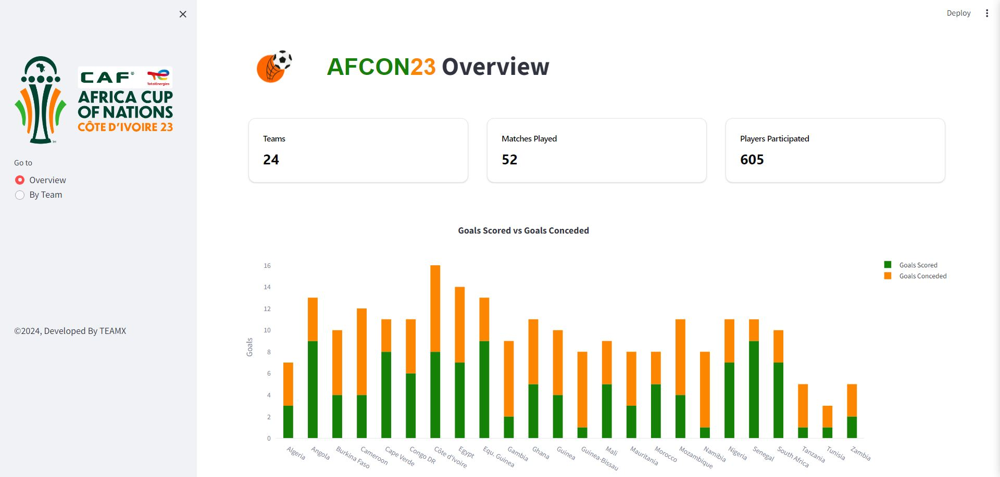

  <h1 id="top" align="center"> ⚽ AFCON23 Streamlit Dashboard </h1>

  </a>

<h2 id="about-section"> 👋 About </h2>
Welcome to the AFCON23 Dashboard! This dashboard will represent an interactive and informative platform offering fans, analysts, and sports enthusiasts an in-depth look at the African Cup of Nations 2023.  With various data sources, interactive visualizations, and detailed statistics, this dashboard will offer a complete and dynamic vision of the competition.   If you like the repo, please feel free to give it a ⭐ (top right).

<h2 id="features"> 🌟 Features</h2>
<b>  ●  Team Statistics:</b> Detailed statistics for each team, including performance metrics.  
<b>  ●  Player Statistics:</b> Insights into player performances, top scorers, and key players.  
<b>  ●  Interactive Visualizations:</b> Graphs and charts to visualize data trends and comparisons.  
<b>  ●  User-friendly Interface:</b> Easy-to-navigate interface built with Streamlit.

<h2 id="data-collection"> 🔎 Data Collection</h2>
For data collection, We Scrape data from the football stats website FBRef : <li><a href="https://fbref.com/en/comps/656/2024/stats/2024-league-Stats">2023 Africa Cup of Nations Stats</a></li>  We performed this web scraping process on two separate datasets: one covering the participating teams and the other on the players involved in the competition.
